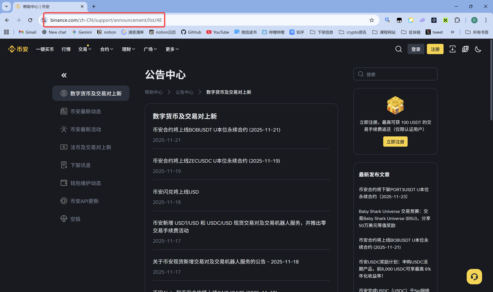
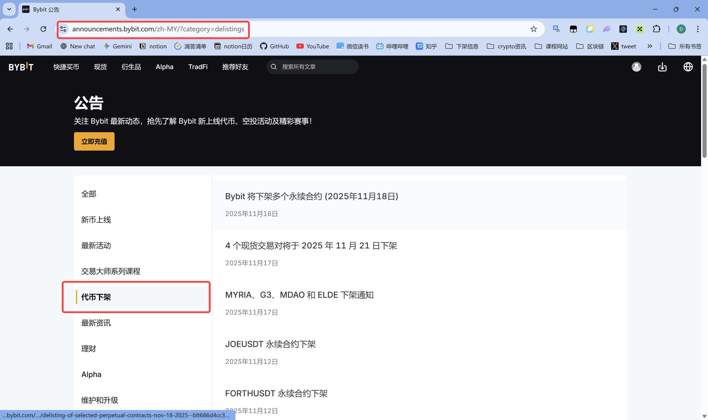
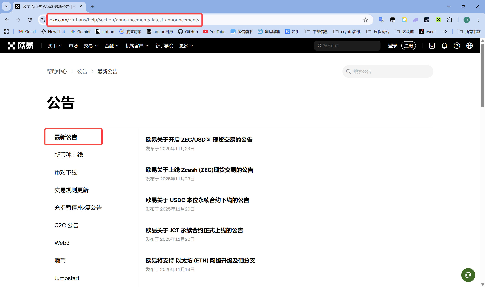
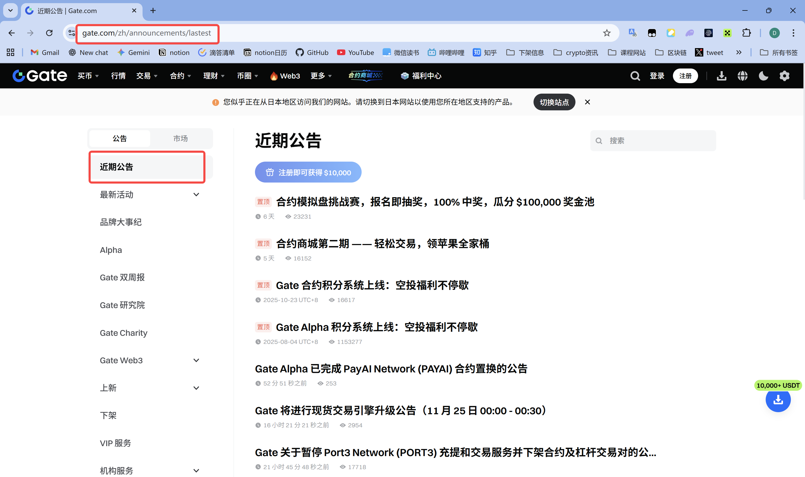
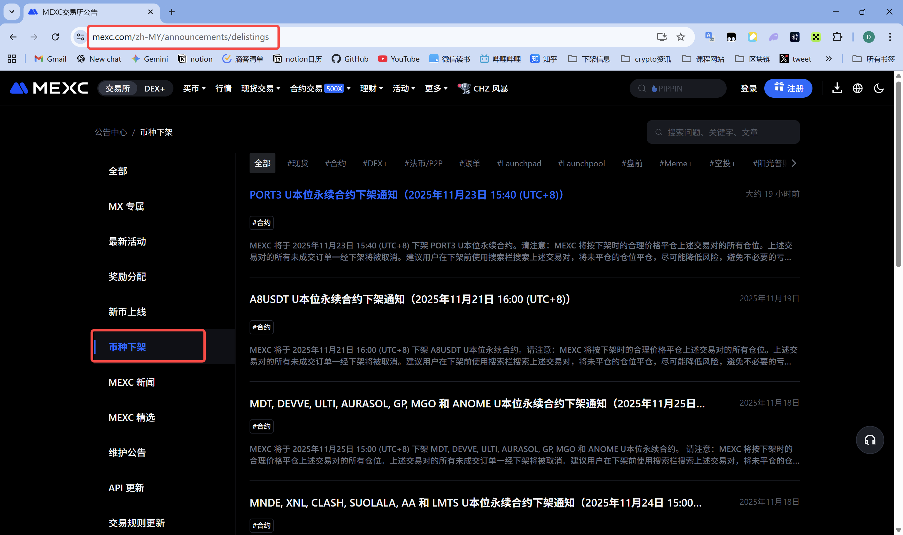
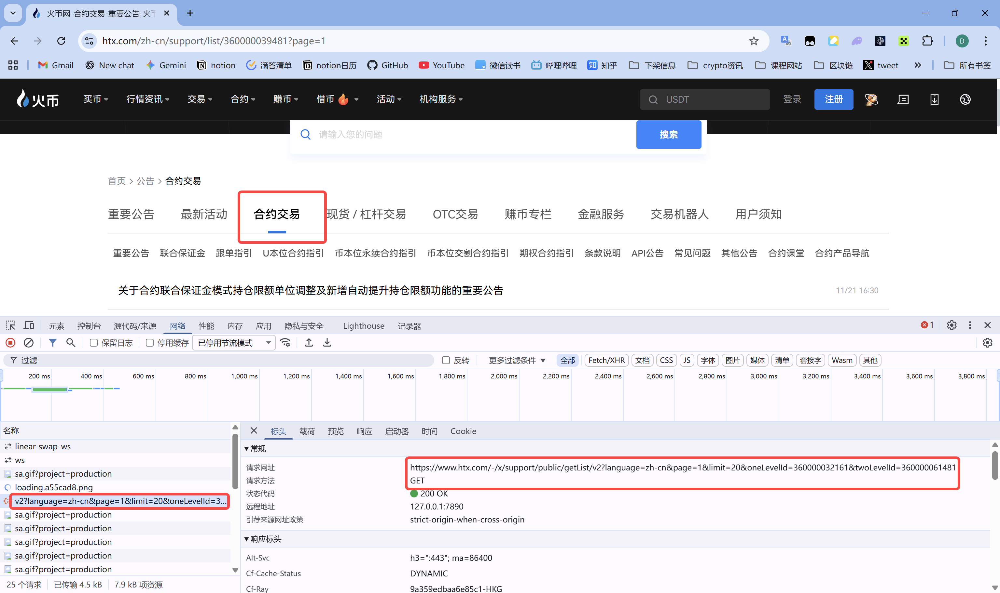
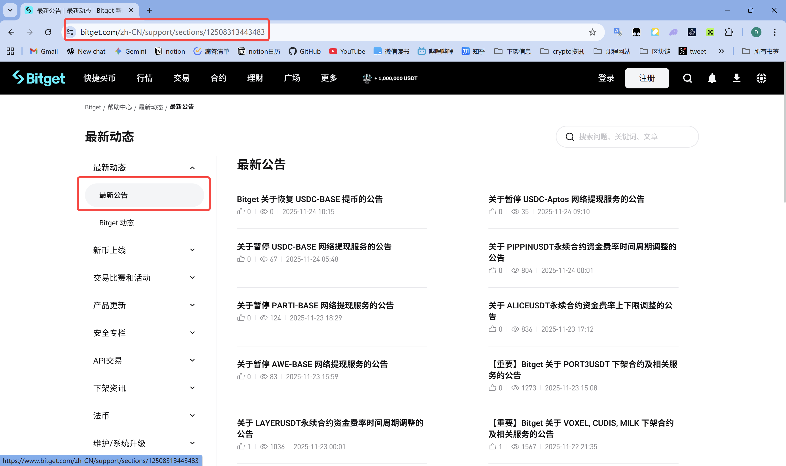
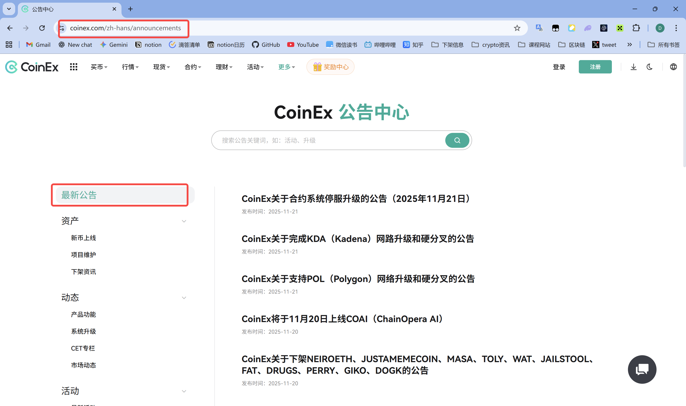

# 扩展交易所监听范围教程

本文档介绍如何为现有交易所添加更多公告类型的监听。

## 概述

每个交易所都支持监听多种类型的公告（如退市公告、维护更新、新币上线等）。通过修改对应交易所文件中的字典配置，可以轻松扩展监听范围。

## 基本原理

每个交易所的实现文件（`exchange/xxx.py`）都包含：

1. **公告类型字典**：定义可监听的公告分类及其对应的参数
2. **初始化方法**：默认监听字典中的所有类型
3. **扩展说明**：文件顶部的注释说明如何获取新的分类参数

## 各交易所扩展指南

### 1. Binance（币安）

**文件位置**：`exchange/binance.py`

**参数类型**：`catalogId`（整数）

**现有配置**：
```python
CATALOG_IDS = {
    "binance_latest": 49,      # 币安最新动态
    "delisting_info": 161,     # 下架讯息
    "wallet_maintenance": 157   # 钱包维护动态
}
```

**如何获取新的 catalogId**：

1. 访问币安公告页面：https://www.binance.com/zh-CN/support/announcement
2. 点击你想监听的公告分类（如"新币上线"）
3. 观察浏览器地址栏，会显示类似：
   ```
   https://www.binance.com/zh-CN/support/announcement/list/49
   ```
4. 最后的数字 `49` 就是 `catalogId`

**参考截图**：


**添加新类型**：
```python
CATALOG_IDS = {
    "binance_latest": 49,
    "delisting_info": 161,
    "wallet_maintenance": 157,
    "new_listing": 48,          # 新增：新币上线
    "api_updates": 108,         # 新增：API 更新
}
```

---

### 2. Bybit

**文件位置**：`exchange/bybit.py`

**参数类型**：`category`（字符串）

**现有配置**：
```python
CATEGORIES = {
    "delistings": "delistings",              # 退市公告
    "maintenance": "maintenance_updates",    # 维护更新
    "all": "",                                # 所有公告
}
```

**如何获取新的 category**：

1. 访问 Bybit 公告页面：https://announcements.bybit.com/zh-MY/
2. 点击不同的分类标签
3. 观察地址栏的 `category` 参数：
   ```
   https://announcements.bybit.com/zh-MY/?category=delistings
   https://announcements.bybit.com/zh-MY/?category=new_crypto
   ```
4. `?category=` 后面的值就是要添加的参数

**参考截图**：


**添加新类型**：
```python
CATEGORIES = {
    "delistings": "delistings",
    "maintenance": "maintenance_updates",
    "new_crypto": "new_crypto",              # 新增：新币上线
    "latest_activities": "latest_activities", # 新增：最新活动
    "all": "",
}
```

---

### 3. OKX（欧易）

**文件位置**：`exchange/okx.py`

**参数类型**：`section path`（字符串）

**现有配置**：
```python
SECTION_PATHS = {
    "latest": "announcements-latest-announcements",  # 最新公告
    "delistings": "announcements-delistings",        # 退市公告
    "activities": "announcements-activities",        # 活动公告
}
```

**如何获取新的 section path**：

1. 访问 OKX 帮助中心：https://www.okx.com/zh-hans/help
2. 找到"公告"分类，点击具体的子分类
3. 地址栏会显示：
   ```
   https://www.okx.com/zh-hans/help/section/announcements-latest-announcements
   ```
4. `section/` 后面的部分就是 `section path`

**参考截图**：


**添加新类型**：
```python
SECTION_PATHS = {
    "latest": "announcements-latest-announcements",
    "delistings": "announcements-delistings",
    "activities": "announcements-activities",
    "token_listings": "announcements-token-listings",  # 新增：代币上线
    "wallet": "announcements-wallet",                  # 新增：钱包公告
}
```

---

### 4. Gate

**文件位置**：`exchange/gate.py`

**参数类型**：`listing path`（字符串）

**现有配置**：
```python
LISTING_PATHS = {
    "latest": "announcements/lastest",    # 最新公告
    "delisted": "announcements/delisted", # 退市公告
}
```

**如何获取新的 listing path**：

1. 访问 Gate 公告页面：https://www.gate.com/zh/announcements
2. 点击不同的分类选项卡
3. 地址栏会显示：
   ```
   https://www.gate.com/zh/announcements/lastest
   https://www.gate.com/zh/announcements/delisted
   ```
4. 域名后面的路径部分就是 `listing path`

**参考截图**：


**添加新类型**：
```python
LISTING_PATHS = {
    "latest": "announcements/lastest",
    "delisted": "announcements/delisted",
    "new_listing": "announcements/new_listing",      # 新增：新币上线
    "activities": "announcements/activities",        # 新增：活动公告
}
```

---

### 5. MEXC

**文件位置**：`exchange/mexc.py`

**参数类型**：`listing path`（字符串）

**现有配置**：
```python
LISTING_PATHS = {
    "delistings": "announcements/delistings",              # 退市公告
    "maintenance": "announcements/maintenance-updates",    # 维护更新
    "trading": "announcements/trading-updates",            # 交易更新
}
```

**如何获取新的 listing path**：

1. 访问 MEXC 公告页面：https://www.mexc.com/zh-MY/announcements
2. 查看不同分类的链接
3. 地址栏格式：
   ```
   https://www.mexc.com/zh-MY/announcements/delistings
   https://www.mexc.com/zh-MY/announcements/new-listings
   ```
4. 语言代码后的路径就是 `listing path`

**参考截图**：


**添加新类型**：
```python
LISTING_PATHS = {
    "delistings": "announcements/delistings",
    "maintenance": "announcements/maintenance-updates",
    "trading": "announcements/trading-updates",
    "new_listings": "announcements/new-listings",      # 新增：新币上线
    "activities": "announcements/activities",          # 新增：活动公告
}
```

---

### 6. Huobi (HTX)

**文件位置**：`exchange/huobi.py`

**参数类型**：`(oneLevelId, twoLevelId)` 元组（字符串对）

**现有配置**：
```python
CATEGORY_PAIRS = {
    "important": ("360000031902", "360000039481"),      # 重要公告
    "futures": ("360000032161", "360000061481"),        # 合约交易
    "spot": ("115000389432", "900000741690"),           # 币币交易
}
```

**如何获取新的 ID 对**：

1. 访问 HTX 支持中心：https://www.htx.com/zh-cn/support
2. 点击不同的分类和子分类
3. 使用浏览器开发者工具（F12）查看网络请求
4. 找到 `getList/v2` 请求，查看请求参数：
   ```
   oneLevelId: 360000031902
   twoLevelId: 360000039481
   ```

**参考截图**：


**添加新类型**：
```python
CATEGORY_PAIRS = {
    "important": ("360000031902", "360000039481"),
    "futures": ("360000032161", "360000061481"),
    "spot": ("115000389432", "900000741690"),
    "margin": ("360000032161", "360000061482"),        # 新增：杠杆交易
    "etf": ("360000032161", "360000061483"),           # 新增：ETF 产品
}
```

---

### 7. Bitget

**文件位置**：`exchange/bitget.py`

**参数类型**：`section ID`（字符串）

**现有配置**：
```python
SECTION_IDS = {
    "latest": "12508313443483",      # 最新公告
    "delistings": "12508313443290",  # 退市公告
}
```

**如何获取新的 section ID**：

1. 访问 Bitget 帮助中心：https://www.bitget.com/zh-CN/support
2. 点击"公告"相关分类
3. 地址栏会显示：
   ```
   https://www.bitget.com/zh-CN/support/sections/12508313443483
   ```
4. `sections/` 后面的数字就是 `section ID`

**参考截图**：


**添加新类型**：
```python
SECTION_IDS = {
    "latest": "12508313443483",
    "delistings": "12508313443290",
    "new_listings": "12508313443291",    # 新增：新币上线
    "activities": "12508313443292",      # 新增：活动公告
}
```

---

### 8. CoinEx

**文件位置**：`exchange/coinex.py`

**参数类型**：`category ID`（字符串，可选）

**现有配置**：
```python
CATEGORY_IDS = {
    "delistings": "14108182730900",  # 退市公告
    "latest": None,                   # 最新公告（不指定category）
}
```

**如何获取新的 category ID**：

1. 访问 CoinEx 公告页面：https://www.coinex.com/zh-hans/announcements
2. 点击相关的分类标签
3. 观察地址栏的 `category` 参数：
    ```
    https://www.coinex.com/zh-hant/announcements?category=14108182730900
    ```
4. `category=` 后面的值就是要添加的参数

**参考截图**：


**添加新类型**：
```python
CATEGORY_IDS = {
    "delistings": "14108182730900",
    "new_listings": "14108182730901",    # 新增：新币上线
    "maintenance": "14108182730902",      # 新增：维护公告
    "latest": None,
}
```

**注意**：`None` 表示不指定 category，会获取所有类型的公告。

---

## 扩展步骤总结

### 步骤 1：找到要扩展的交易所文件

在 `exchange/` 目录下找到对应的 `.py` 文件。

### 步骤 2：获取新的分类参数

根据上述各交易所的说明，访问相应的公告页面，获取新分类的参数。

### 步骤 3：更新字典配置

在文件中找到对应的字典（如 `CATALOG_IDS`、`CATEGORIES` 等），添加新的键值对：

```python
# 示例：添加新的公告类型
CATEGORIES = {
    "delistings": "delistings",
    "maintenance": "maintenance_updates",
    "new_crypto": "new_crypto",          # 新增这一行
    "all": "",
}
```

### 步骤 4：验证配置

运行测试脚本验证新配置是否生效：

```bash
# 测试单个交易所
python quickstart.py

# 或使用标签测试工具
python test_tagger.py -l 5
```

### 步骤 5：观察日志

查看程序输出，确认新类型的公告是否被正确获取：

```
[Bybit   ] 获取到 10 条公告
[OKX     ] 获取到 8 条公告
...
```

---

## 常见问题

### Q1: 添加了新类型但没有获取到公告？

**可能原因**：
1. 参数填写错误，检查拼写和大小写
2. 该分类下暂时没有公告
3. API 发生变化，需要更新代码

**解决方法**：
- 手动访问该分类页面确认是否有公告
- 检查浏览器开发者工具的网络请求
- 对比参数格式是否正确

### Q2: 如何临时禁用某个分类？

在字典中注释掉对应行：

```python
CATEGORIES = {
    "delistings": "delistings",
    # "maintenance": "maintenance_updates",  # 临时禁用
    "all": "",
}
```

### Q3: 能否自定义初始化时监听的类型？

可以！在实例化时传入参数：

```python
# 示例：只监听退市公告
from exchange.bybit import BybitAnnouncementSource

source = BybitAnnouncementSource(
    categories=["delistings"]  # 只监听这一个类型
)
```

### Q4: 如何调试新添加的分类？

使用 Python 交互式环境测试：

```python
from exchange.bybit import BybitAnnouncementSource

# 创建实例
source = BybitAnnouncementSource()

# 获取公告
announcements = source.fetch_latest(limit=5)

# 查看结果
for ann in announcements:
    print(f"{ann.title} - {ann.url}")
```

---

## 高级技巧

### 1. 合并相似分类

如果某个交易所有多个相似的分类，可以合并监听：

```python
LISTING_PATHS = {
    "all_new": [
        "announcements/new_listing",
        "announcements/new_token",
        "announcements/new_pair"
    ]
}
```

然后在代码中循环处理。

### 2. 动态加载配置

可以将分类配置移到 `config.yaml` 中：

```yaml
exchanges:
  bybit:
    categories:
      - delistings
      - maintenance_updates
      - new_crypto
```

### 3. 添加日志

在获取公告时添加详细日志：

```python
def _fetch_by_category(self, category: str, limit: int):
    print(f"[调试] 正在获取分类: {category}")
    # ... 原有代码 ...
    print(f"[调试] 获取到 {len(items)} 条公告")
```

---

## 参考资源

- 各交易所公告页面链接已在上述各节中列出
- 浏览器开发者工具使用：按 F12 打开，切换到"网络"(Network)标签
- 正则表达式测试工具：https://regex101.com/

---

## 贡献

如果你添加了新的公告分类或发现了更好的获取方法，欢迎提交 PR 或 Issue！

**提交格式**：
```
交易所名称：XXX
分类名称：XXX
参数值：XXX
获取方法：简要说明
```

---

## 总结

通过修改各交易所文件中的字典配置，可以轻松扩展监听范围。关键步骤：

1. 访问交易所公告页面
2. 获取分类对应的参数（catalogId / category / section path 等）
3. 更新代码中的字典配置
4. 测试验证

大部分交易所的参数都可以从浏览器地址栏直接看到，少数需要查看网络请求。遇到问题时，可以参考本文档或查看交易所文件顶部的注释说明。
